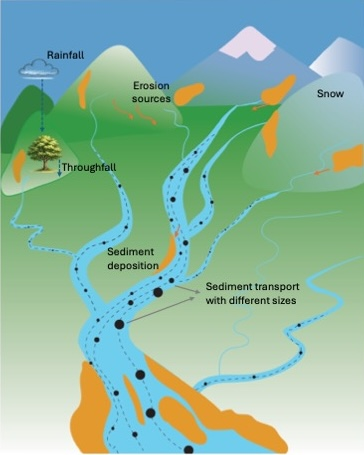
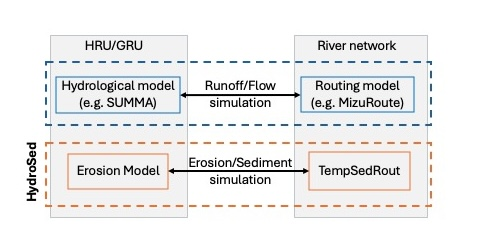

# sedhydro
SedHydro is a hydrological-model-coupled, multi-fraction erosion and sediment transport framework designed for simulation of erosion, transport, deposition, and re-entrainment of sediment across river basins of any scale. The framework is modular and hydrology-model agnostic, allowing coupling with any hydrological model capable of providing the required hydrological forcing and river hydraulic variables. The framework has been developed to provide a flexible and computationally scalable environment to coupling externally simulated hydrology with spatially distributed erosion processes and physically based river sediment routing.
<p align="center">
  
</p>
The framework was developed to address several limitations commonly encountered in hydro-
sediment modelling systems, including:
• poor representation of geomorphic processes within the river network, which strongly affects
sediment transport,
• limited representation of hillslope sediment connectivity,
• inability to separately route sediment fractions,
• insufficient representation of cold-region processes,
• strong dependency on a specific hydrological model structure,
• and computational limitations for large river basins and long simulation periods.

SedHydro integrates multiple sediment-process components into a unified modular framework in-
cluding:
• spatially distributed erosion generation,
• hillslope sediment delivery routing,
• physical-based river sediment transport,
• multi-fraction sediment dynamics,
• and depressional storage attenuation.

<p align="center">
  
</p>

Repository Structure
```
SedHydro/
│
├── SedHydro.py
├── SedHydro_mp.py
├── optimisation_updated.py
├── utils.py
├── mapMaker.py
├── directory_settings_*.toml
├── environment.yml
│
├── TempSedRout/
│   ├── TempSedRout_function.py
│   ├── TempSedRout_storage_function.py
│   └── constants.toml
│
├── outputs/
├── settings/
├── shapefiles/
├── attributes/
└── data/
```

Installation

See: SedHydro_Installation_Guide.md

Citation
